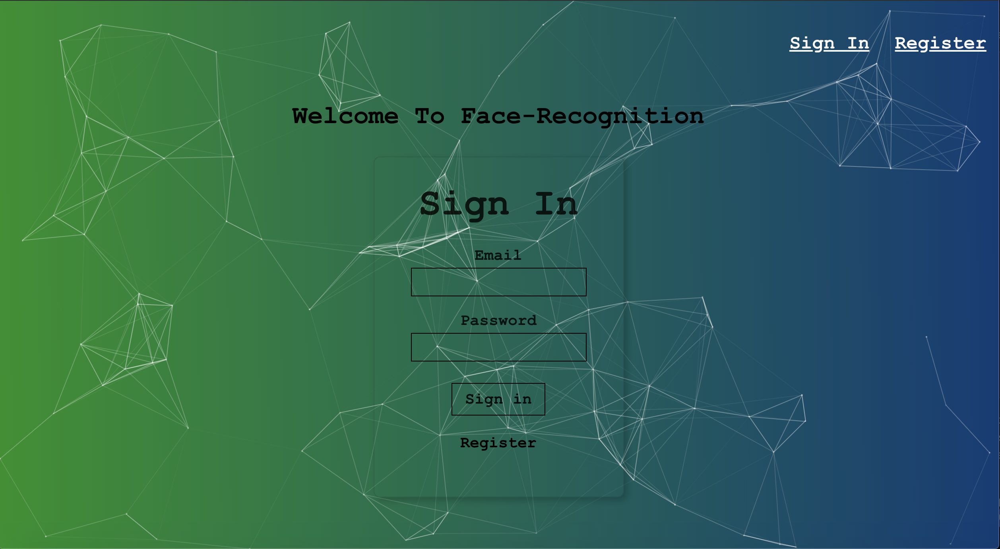

# Face - Recognition

The application is a image face recognition app using Postgres, React, Clarifai, and Tachyons. Users can login or register to the app and paste a link to a image in the input area that will detect every face in the image with a box while updating the user's count with every image. 

Sign-in and register page above

# Getting Started 

Site Link: [Face Recognition](https://face-recog01.herokuapp.com/)

After logging in or registering, the user will be taken to the main page where they can paste a link to a pic and after clicking the Detect button, the Clarifai API is used to detect a face in the picture. A demo in gif form in shown below with a link to a pic of Brad Pitt: 

### Prerequisites

Your can access the site from any interest browser including [Google Chrome](https://www.google.com/chrome/), [Firefox](https://www.mozilla.org/en-US/firefox/new/), or [Safari](https://www.apple.com/safari/). 

# Deployment 

This site is deployed through [heroku](https://codechat-v1.herokuapp.com/),and uses Postgres for storing login information about the users and the number of entries they make. 

# Built With 
* React.js 
* Javascript/JQuery
* Tachyons
* Postgres
* Clarifai
* Heroku
* NPM 
    - Particle.js
    - Express.js
    - Body-parser
    - bcrypt-nodejs
    - knex
    - cors

APIs and Libraries 

* [Tachyons](http://tachyons.io/)

    Create fast loading, highly readable, and 100% responsive interfaces with as little css as possible. CSS toolkit. 

* [Clarifai](https://clarifai.com/models/face-detection-image-recognition-model-a403429f2ddf4b49b307e318f00e528b-detection#documentation)

    Face detection API 

# Wireframe and Layout

